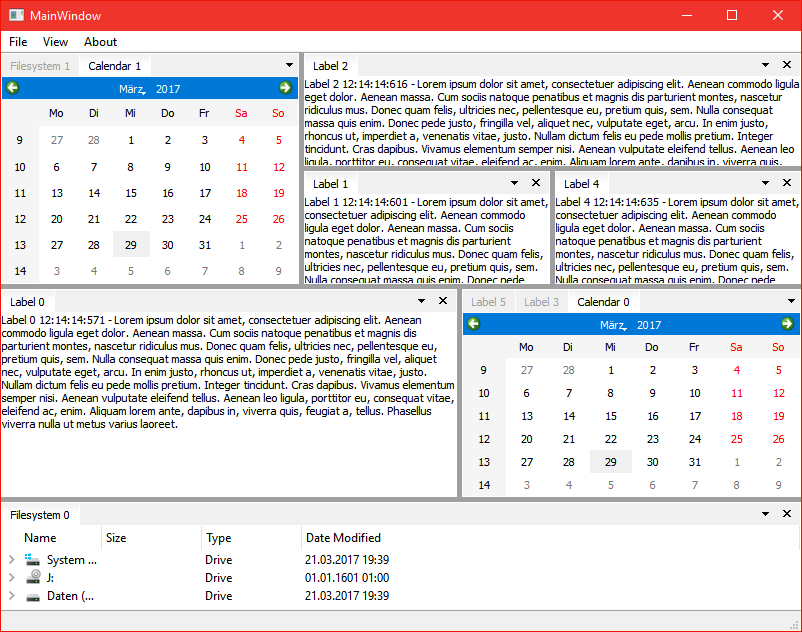
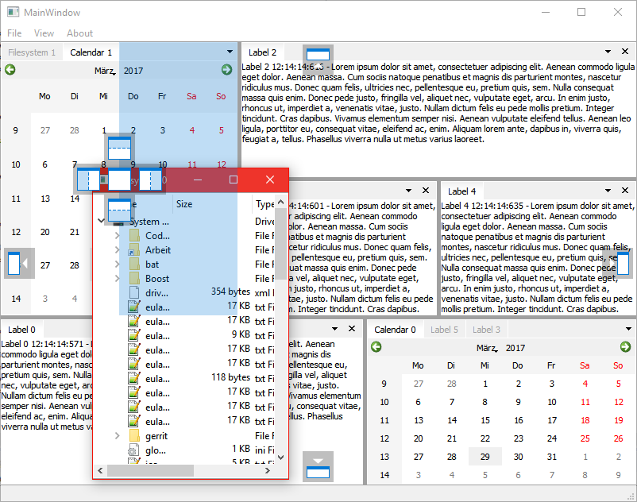

# Advanced Docking System
Manages content widgets more like Visual Studio or similar programs.
I also try to get everything done with basic Qt functionality.
Basic usage of QWidgets an QLayouts and using basic styles as much as possible.




## Tested Compatible Environments
- Windows 10 / Qt 5.5.1 / VC12
- Windows 10 / Qt 5.5.1 / MinGW
- Windows 10 / Qt 4.5.3 / VC9
- Ubuntu 15.10

## Build
Open the `build.pro` with QtCreator and start the build, that's it.
You can run the demo project and test it yourself.

## Release & Development
The `master` branch is not guaranteed to be stable or does not even build, since it is the main working branch.
If you want a version that builds, you should always use a release/beta tag.

## Getting started / Example
The following example shows the minimum code required to use ADS.

_MyWindow.h_
```cpp
#include <QMainWindow>
#include "ads/API.h"
#include "ads/ContainerWidget.h"
#include "ads/SectionContent.h"
class MyWindow : public QMainWindow
{
	Q_OBJECT
public:
	MyWindow(QWidget* parent);
	
private:
	// The main container for dockings.
	ADS_NS::ContainerWidget* _container;
	
	// You always want to keep a reference of your content,
	// in case you need to perform any action on it (show, hide, ...)
	ADS_NS::SectionContent::RefPtr _sc1; 
};
```

_MyWindow.cpp_
```cpp
#include "MyWindow.h"
#include <QLabel>
MyWindow::MyWindow(QWidget* parent) : QMainWindow(parent)
{
	_container = new ADS_NS::ContainerWidget();
	setCentralWidget(_container);
	
	_sc1 = ADS_NS::SectionContent::newSectionContent(QString("Unique-Internal-Name"), _container, new QLabel("Visible Title"), new QLabel("Content Widget"));
	_container->addSectionContent(_sc1, NULL, ADS_NS::CenterDropArea);
}
```

## Developers
[Manuel Freiholz](https://mfreiholz.de), Project Maintainer

## License information


This projects uses the [WTFPL license](http://www.wtfpl.net/)
(Do **W**hat **T**he **F**uck You Want To **P**ublic **L**icense)

Using it? Let us know by creating a [new issue](https://github.com/mfreiholz/qt-docks/issues/new) (You don't have to, of course).

## Credits
- Drop indicator images from [Code Project Article](http://www.codeproject.com/Articles/140209/Building-a-Docking-Window-Management-Solution-in-W)
