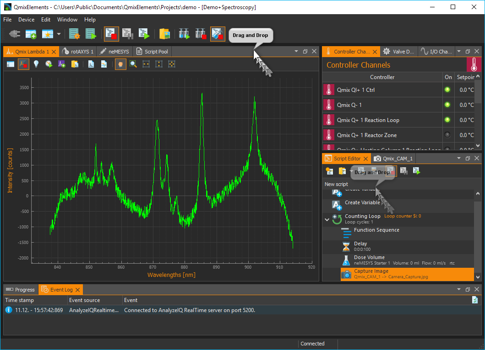
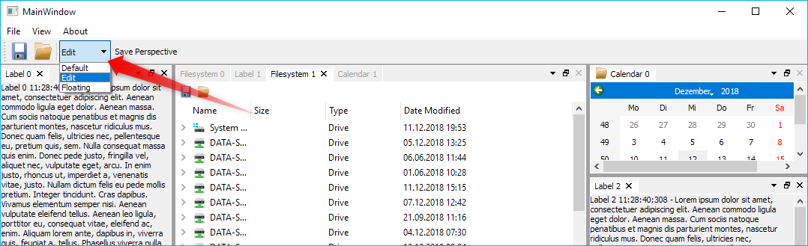

# Advanced Docking System for Qt

Qt Advanced Docking System lets you create customizable layouts using a full 
featured window docking system similar to what is found in many popular 
integrated development environements (IDEs) such as Visual Studio. 
Everything is implemented with standard Qt functionality without any
platform specific code. Basic usage of QWidgets an QLayouts and using basic 
styles as much as possible.

This work is based on and inspired by the 
[Advanced Docking System for Qt](https://github.com/mfreiholz/Qt-Advanced-Docking-System) 
from Manuel Freiholz. I did an almost complete rewrite of his code to improve
code quality, readibility and to fix all issues from the issue tracker 
of his docking system project.

## Features
### Docking everywhere - no central widget
There is no central widget like in the Qt docking system. You can dock on every
border of the main window or you can dock into each dock area - so you are
free to dock almost everywhere.

\
\

### Docking inside floating windows
There is no difference between the main window and a floating window. Docking
into floating windows is supported.

\
\

### Grouped dragging
When dragging the titlebar of a dock, all the tabs that are tabbed with it are 
going to be dragged. So you can move complete groups of tabbed widgets into
a floating widget or from one dock area to another one.

\
\

### Perspectives for fast switching of the complete main window layout
A perspective defines the set and layout of dock windows in the main
window. You can save the current layout of the dockmanager into a named
perspective to make your own custom perspective. Later you can simply
select a perspective from the perspective list to quickly switch the complete 
main window layout.

\
\

## Tested Compatible Environments
- Windows 10

## Build
Open the `ads.pro` with QtCreator and start the build, that's it.
You can run the demo project and test it yourself.

## Developers
- Uwe Kindler, Project Maintainer
- Manuel Freiholz 

## License information
This project uses the [LGPLv2.1 license](gnu-lgpl-v2.1.md)

