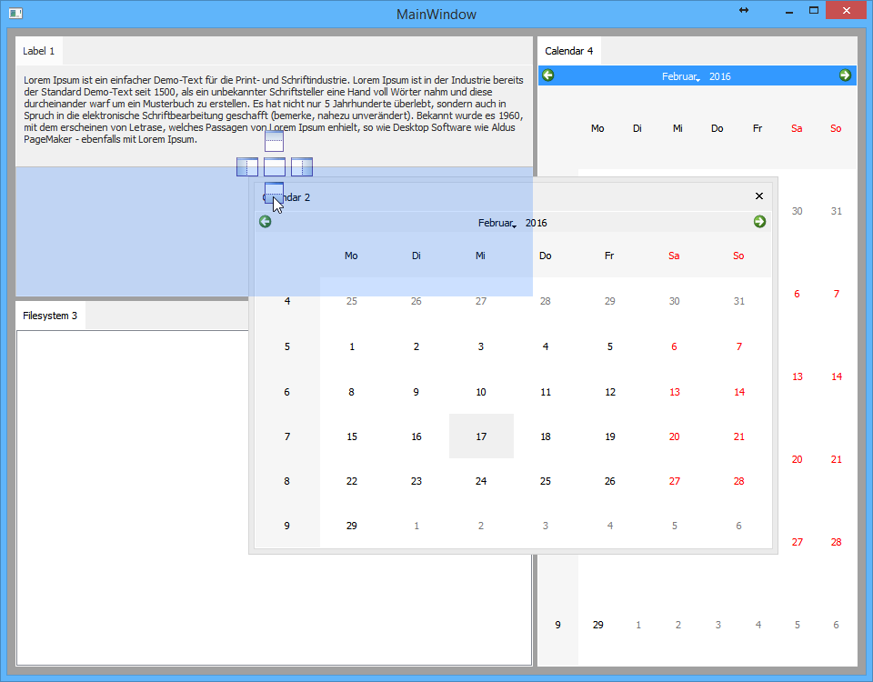

# Advanced Docking System
Manages content widgets more like Visual Studio or similar programs.
I also try to get everything done with basic Qt functionality.
Basic usage of QWidgets an QLayouts and using basic styles as much as possible.

## Tested Compatible Environments
- Windows 10 / Qt 5.5.1 / VC12
- Windows 10 / Qt 5.5.1 / MinGW
- Windows 10 / Qt 4.5.3 / VC9
- Ubuntu 15.10

## Build
Open the `build.pro` with QtCreator and start the build, that's it.
You can run the demo project and test it yourself.

## Release & Development
The `master` branch is not guaranteed to be stable or does not even build, since it is the main working branch.
If you want a version that builds, you should always use a release/beta tag.

## Developers
[Manuel Freiholz](https://mfreiholz.de), Project Maintainer

## License information

This projects uses the [WTFPL license](http://www.wtfpl.net/)
(Do **W**hat **T**he **F**uck You Want To **P**ublic **L**icense)

Using it? Let us know by creating a [new issue](https://github.com/mfreiholz/qt-docks/issues/new) (You don't have to, of course).

## Credits
- Drop indicator images from [Code Project Article](http://www.codeproject.com/Articles/140209/Building-a-Docking-Window-Management-Solution-in-W)

## ToDo List & Changelog
Items sorted by priority

### Beta 0.2
- [ ] Use scrolling for SectionWidget tabs?
- [ ] It would be easier when the SectionTitleWidget and SectionContentWidget are created inside the "SectionContent::newSectionContent(..)" method.
  This would make sure, that those two objects always exists.
- [ ] `ContainerWidget::showSectionContent` needs to insert the SC at the correct preferred position of SW
- [ ] Empty splitters, if only 2 or 1 items are in container
- [ ] Restore: Handle out-of-screen geometry for floating widgets
- [ ] Better handling of sizes when dropping contents. Currently it's unpredictable.
	It might be good to use the same width/height as the parent content, if dropped on existing content.
	In case of outer-drop we might use the preferred size of the content.

### Beta 0.1
- [x] Improve FloatingWidget (Remove maximize button, only support close-button which hides the widget)
- [x] Serialize and Deserialize state/size/positions of dockings
- [x] Make compatible with Qt 4.5 (\*ROFL!\*)
- [x] Save and restore FloatingWidget states
- [x] Restore: Manage new or deleted SectionContent objects, which are not available
- [x] Working with outer-edge-drops sometimes leaves empty splitters #BUG
- [x] Clean up of unused e.g. count()<=1 QSplitters doesn't work well #BUG
- [x] Show close button on right corner of SectionWidget. How to safe last section position?
- [x] Serialize state of `_hiddenSectionContents`
- [x] Add "title" to SectionContent object, which will be used in visible areas to display contents name.
- [x] It should be possible to catch the "activeTabChanged" signal for EXTERN_API users
- [x] Add API function to set an SC as active-tab
- [x] Move all lookup maps into ContainterWidget as non-static members, otherwise we can not have the same SC name inside another ContainerWidget instance.
	The uniqueness of a SectionContainer needs to be restricted to its parent ContainerWidget, not global!

### Some day...
- [ ] Drop indicator images should be fully visible over the DropOverlay rectangle
- [ ] Pin contents: Pins a content and its title widget to the edge and opens on click/hover as long as it has focus
- [ ] API: Make it possible to use custom drop images
- [ ] API: Add possibility to make a SectionContent element floatable (`ContainerWidget::setFloating(SectionContent*)`?)

## Notes
- *SectionContent* class may safe a "size-type" property, which defines how the size of the widget should be handled.
	- PerCent: Resize in proportion to other widgets.
	- Fixed: Width or height are fixed (based on orientation).