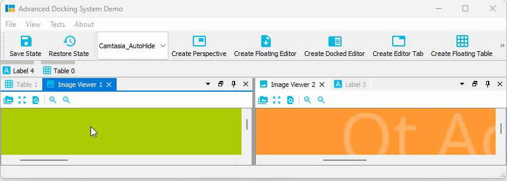
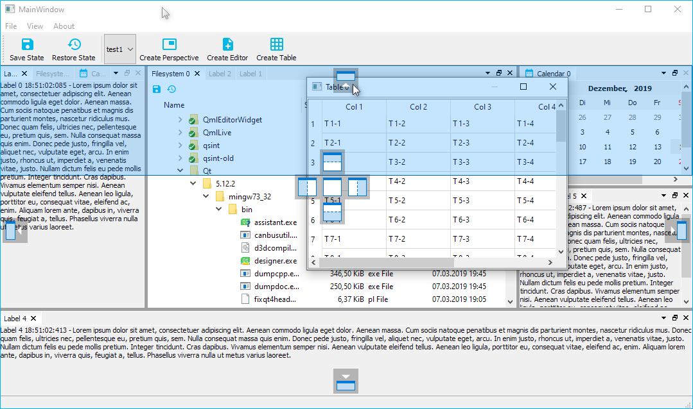
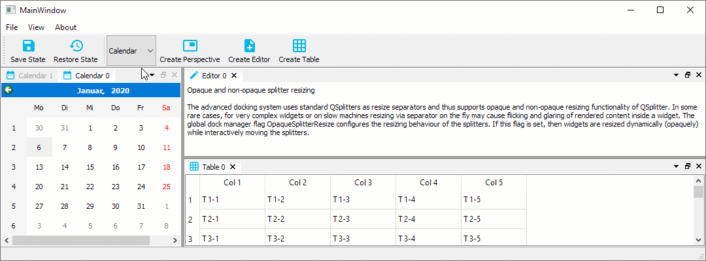
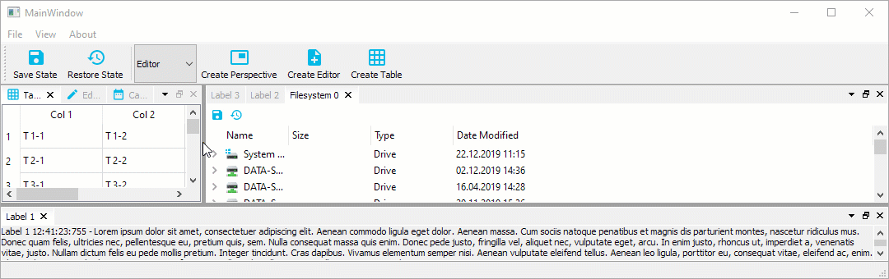
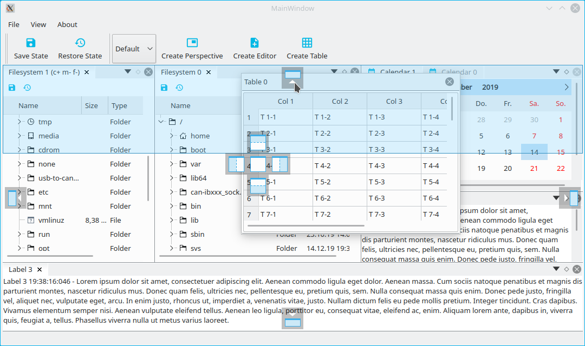
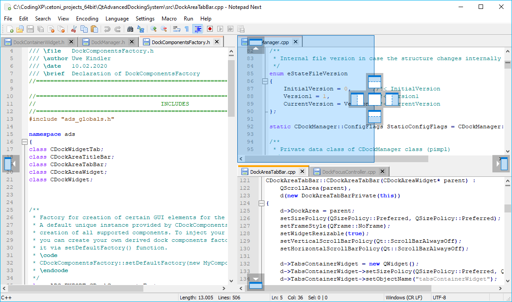
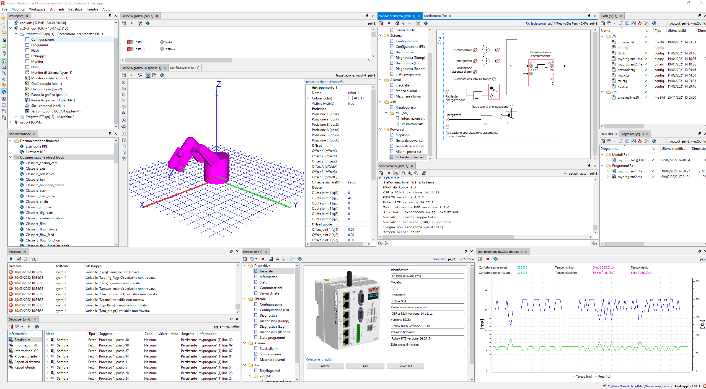
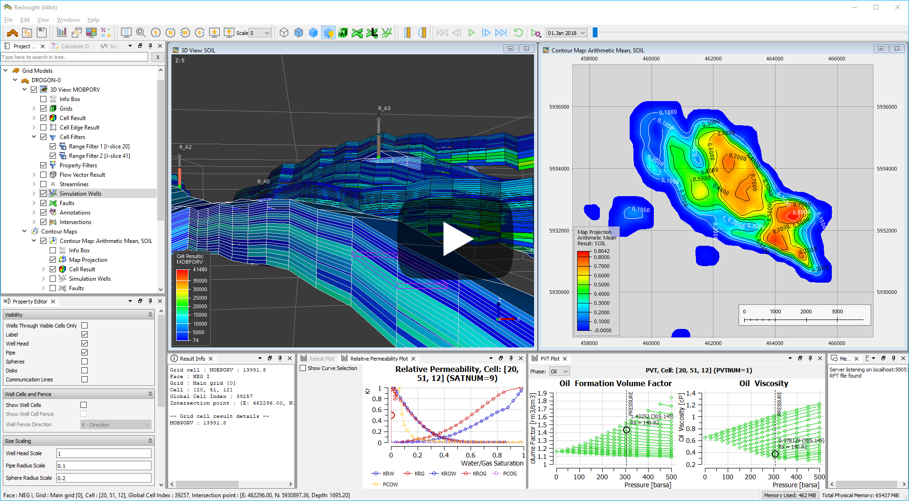

------------------

[](https://github.com/githubuser0xFFFF/Qt-Advanced-Docking-System/releases/latest)
[](gnu-lgpl-v2.1.md)
[](https://github.com/githubuser0xFFFF/Qt-Advanced-Docking-System/actions?query=workflow%3Alinux-builds)
[](https://ci.appveyor.com/project/githubuser0xFFFF/qt-advanced-docking-system/branch/master)
[](https://github.com/githubuser0xFFFF/Qt-Advanced-Docking-System/graphs/contributors)

Qt Advanced Docking System lets you create customizable layouts using a full
featured window docking system similar to what is found in many popular
integrated development environments (IDEs) such as Visual Studio.

- [What's new...](https://github.com/githubuser0xFFFF/Qt-Advanced-Docking-System/releases/latest)
- [Documentation](doc/user-guide.md)
- Original Repository: https://github.com/githubuser0xFFFF/Qt-Advanced-Docking-System

[](https://www.youtube.com/watch?v=7pdNfafg3Qc)

## New and Noteworthy

Release [4.1](https://github.com/githubuser0xFFFF/Qt-Advanced-Docking-System/releases/latest) significantly improves the Auto-Hide functionality and also brings improvements 
for Drag and Drop of dock widgets into dock area tabs. These are the highlights of the new version:

#### Drag & Drop to Auto-Hide

Now you can easily drag any dock widget or any floating widget to the
borders of a window to pin it as a auto-hide tab in one of the 4 sidebars.
If you drag a dock widget close the one of the four window borders, special
drop overlays will be shown to indicate the drop area for auto-hide widgets:


Of course, this also works with dock areas:


If you drag a dock widget or dock area into a sidebar, then you even have
control over where tabs are inserted. Simply drag your mouse over a specific
auto-hide tab, and your dragged dock widget will be inserted before this tab.
Drag to the sidebar area behind the last tab, and the dragged widget will be
appended as last tab. In the following screen capture, the **Image Viewer 1** will
be inserted before the **Table 0** Auto-Hide tab and the **Image Viewer 2**
is appende behind the last tab:



#### Auto-Hide Tab Insertion Order

It is also possible to drag Auto-Hide tabs to a new auto-hide position.
That means, you can drag them to a different border or sidebar:


#### Auto-Hide Tab Sorting

You can drag Auto-Hide tabs to a new position in the current sidebar 
to sort them:


#### Auto-Hide Drag to Float / Dock

But that is not all. You can also simply move Auto-Hide tabs to another
floating widget or dock them via drag and drop:


#### Auto-Hide Context Menu

All Auto-Hide tabs now have a context menu, that provides all the functionality
that you know from Dock widget tabs. With the **Pin To...** item from the
context menu it is very easy to move an Auto-Hide tab to a different Auto-Hide
sidebar:


#### Dock Area Tab Insert Order

And last but not least the new version also improves the docking of widgets
into the tabs of a Dock area. Just as with Auto-Hide tabs, you can now determine the position at which a tab is inserted by moving the mouse over an already existing tab (insertion before the tab) or behind the last tab 
(appending):


The [release 4.0](https://github.com/githubuser0xFFFF/Qt-Advanced-Docking-System/releases/latest)
adds the following features:

- Auto-Hide functionality ([read more...](#auto-hide-functionality))


- improved demo application with new image viewer dock widgets
  


- Visual Studio like CSS theme in demo application

The [release 3.8](https://github.com/githubuser0xFFFF/Qt-Advanced-Docking-System/releases/3.8.3)
adds the following features:

- option to close tabs with the middle mouse button
- `DeleteContentOnClose` flag for dynamic deletion and creation of dock widget
  content
- improved focus highlighting functionality

The [release 3.7](https://github.com/githubuser0xFFFF/Qt-Advanced-Docking-System/releases/tag/3.7.2)
adds the following features:

- support for **Qt6.**
- support for [empty dock area](doc/user-guide.md#empty-dock-area)

The [release 3.6](https://github.com/githubuser0xFFFF/Qt-Advanced-Docking-System/releases/tag/3.6.3)
adds some nice new features:

- support for [central widget](doc/user-guide.md#central-widget) concept


- support for [native floating widgets](doc/user-guide.md#floatingcontainerforcenativetitlebar-linux-only) on Linux


Both features are contributions from ADS users. Read the [documentation](doc/user-guide.md)
to learn more about both new features.

The [release 3.5](https://github.com/githubuser0xFFFF/Qt-Advanced-Docking-System/releases/tag/3.5.0)
adds the new [focus highlighting](doc/user-guide.md#focushighlighting) feature.
This optional feature enables highlighting of the focused dock widget like you
know it from Visual Studio.


 [learn more...](doc/user-guide.md#focushighlighting)

## Features

### Overview

- [New and Noteworthy](#new-and-noteworthy)
    - [Drag \& Drop to Auto-Hide](#drag--drop-to-auto-hide)
    - [Auto-Hide Tab Insertion Order](#auto-hide-tab-insertion-order)
    - [Auto-Hide Tab Sorting](#auto-hide-tab-sorting)
    - [Auto-Hide Drag to Float / Dock](#auto-hide-drag-to-float--dock)
    - [Auto-Hide Context Menu](#auto-hide-context-menu)
    - [Dock Area Tab Insert Order](#dock-area-tab-insert-order)
- [Features](#features)
  - [Overview](#overview)
  - [Docking everywhere - no central widget](#docking-everywhere---no-central-widget)
  - [Docking inside floating windows](#docking-inside-floating-windows)
  - [Grouped dragging](#grouped-dragging)
  - [Perspectives for fast switching of the complete main window layout](#perspectives-for-fast-switching-of-the-complete-main-window-layout)
  - [Opaque and non-opaque splitter resizing](#opaque-and-non-opaque-splitter-resizing)
  - [Cancelable docking process](#cancelable-docking-process)
  - [Tab-menu for easy handling of many tabbed dock widgets](#tab-menu-for-easy-handling-of-many-tabbed-dock-widgets)
  - [Many different ways to detach dock widgets](#many-different-ways-to-detach-dock-widgets)
  - [Supports deletion of dynamically created dock widgets](#supports-deletion-of-dynamically-created-dock-widgets)
  - [Auto-Hide Functionality](#auto-hide-functionality)
- [Python Bindings](#python-bindings)
  - [PySide6](#pyside6)
  - [PyQt5](#pyqt5)
- [Tested Compatible Environments](#tested-compatible-environments)
  - [Supported Qt Versions](#supported-qt-versions)
  - [Windows](#windows)
  - [macOS](#macos)
  - [Linux](#linux)
- [Build](#build)
  - [Qt5 on Ubuntu 18.04 or 20.04](#qt5-on-ubuntu-1804-or-2004)
  - [Qt5 on Ubuntu 22.04](#qt5-on-ubuntu-2204)
  - [Qt6 on Ubuntu 22.04](#qt6-on-ubuntu-2204)
- [Getting started / Example](#getting-started--example)
- [License information](#license-information)
- [Donation](#donation)
- [Showcase](#showcase)
  - [Qt Creator IDE](#qt-creator-ide)
  - [Qt Design Studio](#qt-design-studio)
  - [CETONI Elements](#cetoni-elements)
  - [ezEditor](#ezeditor)
  - [D-Tect X](#d-tect-x)
  - [HiveWE](#hivewe)
  - [Ramses Composer](#ramses-composer)
  - [Plot Juggler](#plot-juggler)
  - [Notepad Next](#notepad-next)
  - [MetGem](#metgem)
  - [PRE Workbench](#pre-workbench)
  - [RDE – Robox Development Environment](#rde--robox-development-environment)
  - [ResInsight](#resinsight)
  - [ADTF 3](#adtf-3)
  - [DREAM.3D NX](#dream3d-nx)
  - [LabPlot](#labplot)
- [Alternative Docking System Implementations](#alternative-docking-system-implementations)
  - [KDDockWidgets](#kddockwidgets)
  - [QtitanDocking](#qtitandocking)
  - [DockingPanes](#dockingpanes)

### Docking everywhere - no central widget

There is no central widget like in the Qt docking system. You can dock on every
border of the main window or you can dock into each dock area - so you are
free to dock almost everywhere.




### Docking inside floating windows

There is no difference between the main window and a floating window. Docking
into floating windows is supported.


### Grouped dragging

When dragging the titlebar of a dock, all the tabs that are tabbed with it are 
going to be dragged. So you can move complete groups of tabbed widgets into
a floating widget or from one dock area to another one.


### Perspectives for fast switching of the complete main window layout

A perspective defines the set and layout of dock windows in the main
window. You can save the current layout of the dockmanager into a named
perspective to make your own custom perspective. Later you can simply
select a perspective from the perspective list to quickly switch the complete 
main window layout.




### Opaque and non-opaque splitter resizing

The advanced docking system uses standard QSplitters as resize separators and thus supports opaque and non-opaque resizing functionality of QSplitter. In some rare cases, for very complex widgets or on slow machines resizing via separator on the fly may cause flicking and glaring of rendered content inside a widget. The global dock manager flag `OpaqueSplitterResize` configures the resizing behaviour of the splitters. If this flag is set, then widgets are resized dynamically (opaquely) while interactively moving the splitters.



If this flag is cleared, the widget resizing is deferred until the mouse button is released - this is some kind of lazy resizing separator.


### Cancelable docking process

In contrast to the standard Qt docking system, docking with the ADS works more like a drag & drop operation. That means, the dragged dock widget or dock area is not undocked immediately. Instead, a drag preview widget is created and dragged around to indicate the future position of the dock widget or dock area. The actual dock operation is only executed when the mouse button is released. That makes it possible, to cancel an active drag operation with the escape key.

The drag preview widget can be configured by a number of global dock manager flags:
- `DragPreviewIsDynamic`: if this flag is enabled, the preview will be adjusted dynamically to the drop area
- `DragPreviewShowsContentPixmap`: the created drag preview window shows a static copy of the content of the dock widget / dock are that is dragged
- `DragPreviewHasWindowFrame`: this flag configures if the drag preview is frameless like a QRubberBand or looks like a real window

### Tab-menu for easy handling of many tabbed dock widgets

Tabs are a good way to quickly switch between dockwidgets in a dockarea. However, if the number of dockwidgets in a dockarea is too large, this may affect the usability of the tab bar. To keep track in this situation, you can use the tab menu. The menu allows you to quickly select the dockwidget you want to activate from a drop down menu.


### Many different ways to detach dock widgets

You can detach dock widgets and also dock areas in the following ways:

- by dragging the dock widget tab or the dock area title bar
- by double clicking the tab or title bar
- by using the detach menu entry from the tab and title bar drop down menu

### Supports deletion of dynamically created dock widgets

Normally clicking the close button of a dock widget will just hide the widget and the user can show it again using the toggleView() action of the dock widget. This is meant for user interfaces with a static amount of widgets. But the advanced docking system also supports dynamic dock widgets that will get deleted on close. If you set the dock widget flag `DockWidgetDeleteOnClose` for a certain dock widget, then it will be deleted as soon as you close this dock widget. This enables the implementation of user interfaces with dynamically created editors, like in word processing applications or source code development tools.

### Auto-Hide Functionality

The 4.0 release of ADS added the new **Auto-Hide** feature. Thanks to the
[initial contribution](https://github.com/githubuser0xFFFF/Qt-Advanced-Docking-System/pull/452) by [Ahmad Syarifuddin](https://github.com/SyarifFakhri) it was
possible to close this long standing [feature request](https://github.com/githubuser0xFFFF/Qt-Advanced-Docking-System/issues/147). The "Auto Hide" feature
allows to display more information using less screen space by hiding or showing
windows pinned to one of the four dock container borders.


The Advanced Docking
System supports "Auto-Hide" functionality for **all** dock containers - that means,
for the main window and for each floating widget. Here is short list of all
auto hide features:

- supported for the main window and all floating dock containers
- supports showing and hiding via mouse click or mouse hover
- respects opaque / non opaque splitter resizing flag
- context menu for pinning a dock widget or a complete dock area to a certain border
- configuration option to configure if the pin button should pin the current
  dock widget tab or a complete dock area
- click the pin button holding the Ctrl key to pin a complete dock area
- fully CSS styleable
- backward compatible state file format - is is possible to load older dock manager
  state files without auto hide support and older versions can load the new state
  files with Auto-Hide state information

More about the auto hide configuration options in the [online documentation...](doc/user-guide.md#auto-hide-configuration-flags)

## Python Bindings


Thanks to the contribution of several users, the Advanced Docking System comes
with a complete Python integration. Python bindings are available for **PyQt5** and
**PySide6**.

### PySide6

A PySide6 ADS package is available via PyPi and can be installed on Windows,
macOS, and Linux with:

```bash
pip install PySide6-QtAds
```

Sample code is available [here](https://github.com/mborgerson/Qt-Advanced-Docking-System/tree/pyside6/examples). To run the samples, you'll also need to install latest qtpy
from source (pip install https://github.com/spyder-ide/qtpy/archive/refs/heads/master.zip).
The PySide6 bindings were contributed by:

- [mborgerson](https://github.com/mborgerson)

Please file PySide6-QtAds-specific issues on its [pyside6_qtads](https://github.com/mborgerson/pyside6_qtads) fork for tracking. For more information about the PySide6 bindings read [this](https://github.com/githubuser0xFFFF/Qt-Advanced-Docking-System/issues/298) issue.

### PyQt5

A package is available via [conda-forge](https://github.com/conda-forge/pyqtads-feedstock).
The python integration has been contributed to this project by the following people:

- [n-elie](https://github.com/n-elie)
- [Hugo Slepicka](https://github.com/hhslepicka)
- [K Lauer](https://github.com/klauer)

A Python integration is also available via PyPi. You can install the
[PyQtAds](https://pypi.org/project/PyQtAds/) package via pip. This feature has been
contributed to this project by:

- [Mira Weller](https://github.com/luelista)

## Tested Compatible Environments

### Supported Qt Versions

The library supports **Qt5** and **Qt6**.

### Windows

Windows 10 [](https://ci.appveyor.com/project/githubuser0xFFFF/qt-advanced-docking-system/branch/master)

The library was developed on and for Windows. It is used in a commercial Windows application and is therefore constantly tested.

### macOS

macOS [](https://travis-ci.org/githubuser0xFFFF/Qt-Advanced-Docking-System)

The application can be compiled for macOS. A user reported, that the library works on macOS. If have not tested it.


### Linux

[](https://travis-ci.org/githubuser0xFFFF/Qt-Advanced-Docking-System)
[](https://github.com/githubuser0xFFFF/Qt-Advanced-Docking-System/actions?query=workflow%3Alinux-builds)

Unfortunately, there is no such thing as a Linux operating system. Linux is a heterogeneous environment with a variety of different distributions. So it is not possible to support "Linux" like it is possible for Windows. It is only possible to support and test a small subset of Linux distributions. The library can be compiled for and has been developed and tested with some Linux distributions. Depending on the used window manager or compositor, dock widgets
with native title bars are supported or not. If native title bars are not supported,
the library switches to `QWidget` based title bars.

- **Kubuntu 18.04 and 19.10** - uses KWin - no native title bars
- **Ubuntu 18.04, 19.10 and 20.04** - native title bars are supported
- **Ubuntu 22.04** - uses Wayland -> no native title bars

There are some requirements for the Linux distribution that have to be met:

- an X server that supports ARGB visuals and a compositing window manager. This is required to display the translucent dock overlays ([https://doc.qt.io/qt-5/qwidget.html#creating-translucent-windows](https://doc.qt.io/qt-5/qwidget.html#creating-translucent-windows)). If your Linux distribution does not support this, or if you disable this feature, you will very likely see issue [#95](https://github.com/githubuser0xFFFF/Qt-Advanced-Docking-System/issues/95).
- Wayland is not properly supported by Qt yet. If you use Wayland, then you should set the session type to x11: `XDG_SESSION_TYPE=x11 ./AdvancedDockingSystemDemo`. You will find more details about this in issue [#288](https://github.com/githubuser0xFFFF/Qt-Advanced-Docking-System/issues/288).

Screenshot Kubuntu:


Screenshot Ubuntu:


## Build

The Linux build requires private header files. Make sure that they are installed.
The library uses SVG icons, so ensure that Qt SVG support is installed. The demo
application creates a `QQuickWidget` for testing, so ensure that the required
libraries are installed.

### Qt5 on Ubuntu 18.04 or 20.04

```bash
sudo apt install qt5-default qtbase5-private-dev
```

### Qt5 on Ubuntu 22.04

```bash
sudo apt install qtbase5-dev qtbase5-private-dev qtbase5-dev-tools libqt5svg5 libqt5qml5 qtdeclarative5-dev
```

### Qt6 on Ubuntu 22.04

```bash
sudo apt install qt6-default qt6-base-dev qt6-base-private-dev qt6-tools-dev libqt6svg6 qt6-qtdeclarative
```

Open the `ads.pro` file with QtCreator and start the build, that's it.
You can run the demo project and test it yourself.

## Getting started / Example

The following example shows the minimum code required to use the advanced Qt docking system.

*MainWindow.h*

```cpp
#include <QMainWindow>
#include "DockManager.h"

namespace Ui {
class MainWindow;
}

class MainWindow : public QMainWindow
{
    Q_OBJECT

public:
    explicit MainWindow(QWidget *parent = 0);
    ~MainWindow();

private:
    Ui::MainWindow *ui;
    
    // The main container for docking
    ads::CDockManager* m_DockManager;
};
```

*MainWindow.cpp*

```cpp
#include "MainWindow.h"
#include "ui_MainWindow.h"

#include <QLabel>

MainWindow::MainWindow(QWidget *parent) :
    QMainWindow(parent),
    ui(new Ui::MainWindow)
{
    ui->setupUi(this);

    // Create the dock manager after the ui is setup. Because the
    // parent parameter is a QMainWindow the dock manager registers
    // itself as the central widget as such the ui must be set up first.
    m_DockManager = new ads::CDockManager(this);

    // Create example content label - this can be any application specific
    // widget
    QLabel* l = new QLabel();
    l->setWordWrap(true);
    l->setAlignment(Qt::AlignTop | Qt::AlignLeft);
    l->setText("Lorem ipsum dolor sit amet, consectetuer adipiscing elit. ");

    // Create a dock widget with the title Label 1 and set the created label
    // as the dock widget content
    ads::CDockWidget* DockWidget = new ads::CDockWidget("Label 1");
    DockWidget->setWidget(l);

    // Add the toggleViewAction of the dock widget to the menu to give
    // the user the possibility to show the dock widget if it has been closed
    ui->menuView->addAction(DockWidget->toggleViewAction());

    // Add the dock widget to the top dock widget area
    m_DockManager->addDockWidget(ads::TopDockWidgetArea, DockWidget);
}

MainWindow::~MainWindow()
{
    delete ui;
}
```

## License information

[](gnu-lgpl-v2.1.md)
This project uses the [LGPLv2.1 license](gnu-lgpl-v2.1.md)

## Donation

If this project help you reduce time to develop or if you just like it, you can give me a cup of coffee :coffee::wink:.

<a href="https://www.paypal.com/cgi-bin/webscr?cmd=_s-xclick&hosted_button_id=85R64TMMSY9T6">
  
</a>

## Showcase

### [Qt Creator IDE](https://www.qt.io/development-tools)

From version 4.12 on, Qt Creator uses the Advanced Docking Framework for its
Qt Quick Designer. This improves the usability when using multiple screens.


### [Qt Design Studio](https://www.qt.io/ui-design-tools)

Taken from the [Qt Blog](https://www.qt.io/blog/qt-design-studio-1.5-beta-released):

> The most obvious change in [Qt Design Studio 1.5](https://www.qt.io/blog/qt-design-studio-1.5-beta-released) is the integration of dock widgets using the Qt Advanced Docking System. This allows the user to fully customize the workspace and also to undock any view into its own top level window. This especially improves the usability when using multiple screens.

[](https://youtu.be/za9KBWcFXEw?t=84)

### [CETONI Elements](https://cetoni.com/cetoni-elements/)

The CETONI Elements software from [CETONI](https://www.cetoni.com) is a comprehensive,
plugin-based and modular laboratory automation software for controlling CETONI devices using a joint graphical user interface. The software features a powerful script system to automate processes. The software uses the advanced docking system to give the user the freedom to arrange all the views and windows that are provided by the various plugins.

[learn more...](https://cetoni.com/cetoni-elements/)

[](https://www.youtube.com/watch?v=7pdNfafg3Qc)

### [ezEditor](https://github.com/ezEngine/ezEngine)

The ezEditor is a full blown graphical editor used for editing scenes and
importing and authoring assets for the [ezEngine](https://github.com/ezEngine/ezEngine) -
an open source C++ game engine in active development.


### [D-Tect X](https://www.duerr-ndt.com/products/ndt-software/d-tect-xray-inspection-software.html)

D-Tect X is a X-ray inspection software for industrial radiography. It is a state-of-the-art 64-bit application which supports GPU (Graphics Processing Unit) acceleration and takes full advantage of computers with multiple CPU cores. A large set of tools assist the user in image analysis and evaluation. Thanks to the Qt Advanced Docking System the flexible and intuitive user interface can be completely customized to  each user’s preference.

[learn more...](https://www.duerr-ndt.com/products/ndt-software/d-tect-xray-inspection-software.html)

[](https://youtu.be/mOor7GmmIJo?t=13)

### [HiveWE](https://github.com/stijnherfst/HiveWE)

HiveWE is a Warcraft III world editor. It focusses on speed and ease of use,
especially for large maps where the regular World Editor is often too slow and clunky.
It has a JASS editor with syntax highlighting, tabs, code completion and more.
The JASS editor uses the Qt Advanced Docking System for the management and layout
of the open editor windows.

[learn more...](https://github.com/stijnherfst/HiveWE)


### [Ramses Composer](https://github.com/GENIVI/ramses-composer)

Ramses Composer is the authoring tool for the open source [RAMSES](https://github.com/GENIVI/ramses)
rendering ecosystem.

Ramses is a low-level rendering engine which is optimized for embedded hardware
mobile devices, automotive ECUs, IoT electronics. Ramses was initially developed
at the BMW Group and open-sourced in 2018 as part of a collaboration initiative
with the Genivi Alliance. It is an important part of the BMW infotainment cluster
and digital portfolio.

[learn more...](https://github.com/GENIVI/ramses-composer)


### [Plot Juggler](https://github.com/facontidavide/PlotJuggler)

PlotJuggler is a fast, powerful and intuitive tool to visualize time series.
It makes it easy to visualize data but also to analyze it. You can manipulate
your time series using a simple and extendable Transform Editor. Some of the
highlights are:

- Simple Drag & Drop user interface.
- Load data from file.
- Connect to live streaming of data.
- Save the visualization layout and configurations to re-use them later.
- Fast OpenGL visualization.
- Can handle thousands of timeseries and millions of data points.
- Transform your data using a simple editor: derivative, moving average, integral, etc…
- PlotJuggler can be easily extended using plugins.

[read more...](https://github.com/facontidavide/PlotJuggler)

[](https://vimeo.com/480588113#t=46s)

### [Notepad Next](https://github.com/dail8859/NotepadNext)

Notepad Next is a cross-platform reimplementation of Notepad++ that uses the 
Advanced Docking System to arrange the open source files on the screen.

[read more...](https://github.com/dail8859/NotepadNext)



### [MetGem](https://metgem.github.io/)

MetGem is an open-source software for tandem mass-spectrometry data visualization.
It's key features are standalone molecular networking and t-SNE based projections.
MetGem uses the Qt-Advanced-Docking-System to manage docks and to create independent
molecular network views.

[read more...](https://metgem.github.io/)


### [PRE Workbench](https://luelista.github.io/pre_workbench/)

Protocol Reverse Engineering Workbench is a software to support researchers in reverse engineering protocols and documenting the results. It supports various sources to import protocol traffic from, helps the discovery process by displaying different views and heuristic-based highlighting on data, and aids in documenting and sharing findings.

PRE Workbench is a Python software and uses the ADS PyQt integration.

[read more...](https://luelista.github.io/pre_workbench/)

[](https://youtu.be/U3op5UreV1Q)

### [RDE – Robox Development Environment](https://www.robox.it/en/product/rde-robox-development-environment/)

This software is a development environment for PAC (Programmable Automation Controllers)
from ROBOX. It offers a lot of tools to write, compile and debug machine control
and application software. The Advanced Docking System helps to organize all the tools and
windows (Project window, Shell window, Monitor windows, Oscilloscope window...)
on the screen to provide a easy to use, highly configurable and visual pleasing
development experience.

[read more...](https://www.robox.it/en/product/rde-robox-development-environment/)



### [ResInsight](https://www.ceetronsolutions.com/projects/resinsight)

ResInsight as a software from Ceetron Solutions for visualization of oil and
gas reservoir simulation data. It allows reservoir models, simulation results,
and measurements to be visualized with very high performance. Optimized use of
graphics technology and simultaneous processing on multiple CPU cores have been
vital to enhance the performance and capacity of ResInsight for large data sets.
The Advanced Docking System has empowered Ceetron to build a much more intuitive
user interface for its ResInsight users.

[read more...](https://resinsight.org/)

[](https://www.youtube.com/watch?v=HzLaQ1p6AUc)

### [ADTF 3](https://www.digitalwerk.net/adtf/)

The Automotive Data and Time-Triggered Framework was designed as a Rapid Prototyping Toolset, Simulation Framework and Test- and Measurement Tool. It is meant for:

- Developing and testing ADAS and HAD components
- Recording of vehicle data for visualisation
- Simulation of complex scenarios in SIL/HIL test environments

The software features time-based processing of multiple data streams and graphical editing of dynamic filter graphs. It also includes an SDK for custom plug-ins and reusable components, as well as components for data visualization in both 2D and 3D. This is was the 
[manual](https://support.digitalwerk.net/adtf/v3/adtf_html/page_adtf_xsystem_plugin.html)
says about the switch to Qt Advanced Docking:

> After several minor improvements the Qt5 ADTF XSystem uses the Advanced Docking System for Qt since ADTF 3.10.0 for more convenience and usability regarding layouting, docking and embedding several widgets.

[read more...](https://support.digitalwerk.net/adtf/v3/adtf_html/index.html)


### [DREAM.3D NX](https://github.com/BlueQuartzSoftware/DREAM3D)

DREAM.3D *(Digital Representation Environment for Analysis of Materials in 3D)* is an open source, cross-platform and modular, software suite that allows users to prepare, reconstruct, quantify, instantiate, and mesh, multidimensional, multimodal microstructural data, as well as many other applications.

[BlueQuartz Software](http://www.bluequartz.net/) is currently completely rewriting the DREAM.3D application. For the upcoming version **[DREAM3D NX](http://www.dream3d.io/)** they improved the UI by using the Advanced Docking System. An [early version](http://www.dream3d.io/) of **DREAM3D NX** with ADS is already available to any user who would like to take the brand new version out for a spin.


[read more...](http://dream3d.bluequartz.net/)

### [LabPlot](https://labplot.kde.org/)

KDE LabPlot is the ultimate free, open source and cross-platform tool for scientists, engineers, and students who need to analyze and visualize data. With its intuitive interface and powerful features, you can create stunning plots and diagrams with ease. Whether you're working with CSV, FITS, or HDF5 data, KDE LabPlot makes it simple to import and analyze your data.

The LabPlot project recently switched to the Qt Advanced Docking System for their user interface. This switch represents a significant improvement to the LabPlot software, allowing users to create and manage complex data visualization layouts with ease.


[read more...](https://labplot.kde.org/)

## Alternative Docking System Implementations

If this Qt Advanced Docking System does not fit to your needs you may consider some of the alternative docking system solutions for Qt.

### KDDockWidgets

This is an advanced docking framework for Qt from [KDAB](https://www.kdab.com/). The interesting thing is, that they separated GUI code from logic, so they can easily provide a QtQuick backend in the future.

- [Blog post about KDDockWidgets](https://www.kdab.com/kddockwidgets/)
- [GitHub project](https://github.com/KDAB/KDDockWidgets)

**License:** dual-licensed, available under both commercial and GPL license.

### QtitanDocking

This is a commercial component from [Developer Machines](https://www.devmachines.com/) for Qt Framework that allows to create a Microsoft like dockable user interface. They also offer a lot of other interesting and useful components for Qt. The library is available

- [Product page](https://www.devmachines.com/qtitandocking-overview.html)

**License:** Commercial license

### DockingPanes

DockingPanes is a library for Qt Widgets that implements docking windows that have the look and feel of Visual Studio. It provides a simple API which allows an application to make use of docking windows with a few calls.

- [GitHub project](https://github.com/KestrelRadarSensors/dockingpanes)

**License:** GPL
