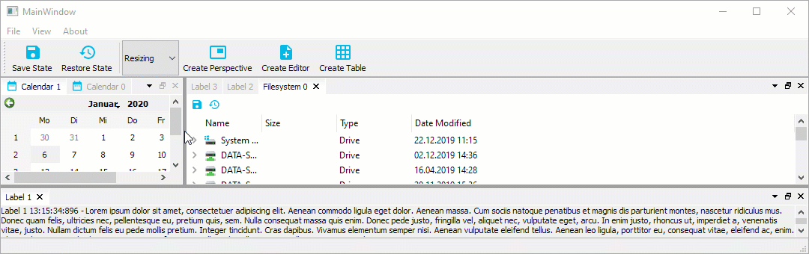

# User Guide

## Configuration Flags

The Advanced Docking System has a number of global configuration options to
configure the design and the functionality of the docking system. Each
configuration will be explained in detail in the following sections.

### Setting Configuration Flags

You should set the configuration flags before you create the dock manager
instance. That means, setting the configurations flags is the first thing
you do, if you use the library.

```c++
CDockManager::setConfigFlags(CDockManager::DefaultOpaqueConfig);
CDockManager::setConfigFlag(CDockManager::RetainTabSizeWhenCloseButtonHidden, true);
...
d->DockManager = new CDockManager(this);
```

If you set the configurations flags, you can set individual flags using the
function `CDockManager::setConfigFlag` or you can set all flags using
the function `CDockManager::setConfigFlags`. Instead of settings all
flags individualy, it is better to pick a predefined set of configuration
flags and then modify individual flags. The following predefined
configurations are avilable

- `DefaultNonOpaqueConfig` - uses non opaque splitter resizing and non opaque docking
- `DefaultOpaqueConfig` - uses opaque splitter resizing and opaque docking

Pick one of those predefined configurations and then modify the following
configurations flags to adjust the docking system to your needs.

### `ActiveTabHasCloseButton`

If this flag is set (default configuration), the active tab in a tab area has
a close button.


If this flag is cleared, the active tab has no close button. You can combine
this with the flag `DockAreaCloseButtonClosesTab` to use the close button
of the dock are to close the single tabs.


### `DockAreaHasCloseButton`

If the flag is set (default configuration) each dock area has a close button.


If this flag is cleared, dock areas do not have a close button.


### `DockAreaCloseButtonClosesTab`

If the flag is set, the dock area close button closes the active tab,
if not set, it closes the complete dock area (default).

### `OpaqueSplitterResize`

The advanced docking system uses standard QSplitters as resize separators and thus supports opaque and non-opaque resizing functionality of QSplitter. In some rare cases, for very complex widgets or on slow machines resizing via separator on the fly may cause flicking and glaring of rendered content inside a widget. This global dock manager flag configures the resizing behaviour of the splitters. If this flag is set, then widgets are resized dynamically (opaquely) while interactively moving the splitters. If you select the predefined configuration `DefaultOpaqueConfig`, then this is the configured behaviour.


If this flag is cleared, the widget resizing is deferred until the mouse button is released - this is some kind of lazy resizing separator. If you select the predefined
configuration `DefaultNonOpaqueConfig`, then this is the configured behaviour.



### `XmlAutoFormattingEnabled`

If enabled, the XML writer automatically adds line-breaks and indentation to
empty sections between elements (ignorable whitespace). This is used, when
the current state or perspective is saved. It is disabled by default.

### `XmlCompressionEnabled`

If enabled, the XML output will be compressed and is not human readable anymore.
This ie enabled by default to minimize the size of the saved data.

### `TabCloseButtonIsToolButton`

If enabled the tab close buttons will be `QToolButtons` instead of `QPushButtons` - 
disabled by default. Normally the default configuration should be ok but if your
application requires `QToolButtons` instead of `QPushButtons` for styling reasons
or for any other reasons, then you can enable this flag.

