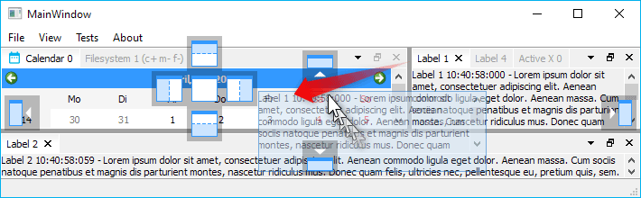
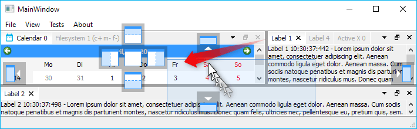
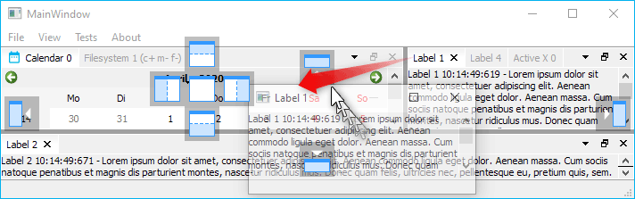
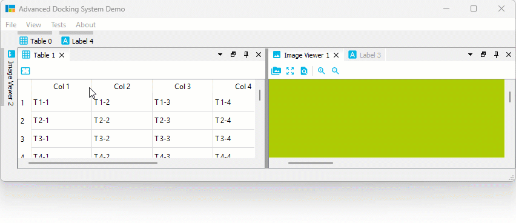

# User Guide

- [Configuration Flags](#configuration-flags)
  - [Setting Configuration Flags](#setting-configuration-flags)
  - [`ActiveTabHasCloseButton`](#activetabhasclosebutton)
  - [`DockAreaHasCloseButton`](#dockareahasclosebutton)
  - [`DockAreaCloseButtonClosesTab`](#dockareaclosebuttonclosestab)
  - [`OpaqueSplitterResize`](#opaquesplitterresize)
  - [`XmlAutoFormattingEnabled`](#xmlautoformattingenabled)
  - [`XmlCompressionEnabled`](#xmlcompressionenabled)
  - [`TabCloseButtonIsToolButton`](#tabclosebuttonistoolbutton)
  - [`AllTabsHaveCloseButton`](#alltabshaveclosebutton)
  - [`RetainTabSizeWhenCloseButtonHidden`](#retaintabsizewhenclosebuttonhidden)
  - [`DragPreviewIsDynamic`](#dragpreviewisdynamic)
  - [`DragPreviewShowsContentPixmap`](#dragpreviewshowscontentpixmap)
  - [`DragPreviewHasWindowFrame`](#dragpreviewhaswindowframe)
  - [`AlwaysShowTabs`](#alwaysshowtabs)
  - [`DockAreaHasUndockButton`](#dockareahasundockbutton)
  - [`DockAreaHasTabsMenuButton`](#dockareahastabsmenubutton)
  - [`DockAreaHideDisabledButtons`](#dockareahidedisabledbuttons)
  - [`DockAreaDynamicTabsMenuButtonVisibility`](#dockareadynamictabsmenubuttonvisibility)
  - [`FloatingContainerHasWidgetTitle`](#floatingcontainerhaswidgettitle)
  - [`FloatingContainerHasWidgetIcon`](#floatingcontainerhaswidgeticon)
  - [`HideSingleCentralWidgetTitleBar`](#hidesinglecentralwidgettitlebar)
  - [`FocusHighlighting`](#focushighlighting)
  - [`EqualSplitOnInsertion`](#equalsplitoninsertion)
  - [`FloatingContainerForceNativeTitleBar` (Linux only)](#floatingcontainerforcenativetitlebar-linux-only)
  - [`FloatingContainerForceQWidgetTitleBar` (Linux only)](#floatingcontainerforceqwidgettitlebar-linux-only)
  - [`MiddleMouseButtonClosesTab`](#middlemousebuttonclosestab)
  - [`DisableTabTextEliding`](#disabletabtexteliding)
  - [`ShowTabTextOnlyForActiveTab`](#showtabtextonlyforactivetab)
- [Auto-Hide Configuration Flags](#auto-hide-configuration-flags)
  - [Auto Hide Dock Widgets](#auto-hide-dock-widgets)
  - [Pinning Auto-Hide Widgets to a certain border](#pinning-auto-hide-widgets-to-a-certain-border)
  - [Show / Hide Auto-Hide Widgets via Mouse Over](#show--hide-auto-hide-widgets-via-mouse-over)
  - [Drag \& Drop to Auto-Hide](#drag--drop-to-auto-hide)
  - [Auto-Hide Tab Insertion Order](#auto-hide-tab-insertion-order)
  - [Auto-Hide Tab Sorting](#auto-hide-tab-sorting)
  - [Auto-Hide Drag to Float / Dock](#auto-hide-drag-to-float--dock)
  - [Auto-Hide Context Menu](#auto-hide-context-menu)
  - [Adding Auto Hide Widgets](#adding-auto-hide-widgets)
  - [Setting Auto-Hide Flags](#setting-auto-hide-flags)
  - [`AutoHideFeatureEnabled`](#autohidefeatureenabled)
  - [`DockAreaHasAutoHideButton`](#dockareahasautohidebutton)
  - [`AutoHideButtonTogglesArea`](#autohidebuttontogglesarea)
  - [`AutoHideButtonCheckable`](#autohidebuttoncheckable)
  - [`AutoHideSideBarsIconOnly`](#autohidesidebarsicononly)
  - [`AutoHideShowOnMouseOver`](#autohideshowonmouseover)
  - [`AutoHideCloseButtonCollapsesDock`](#autohideclosebuttoncollapsesdock)
  - [`AutoHideHasCloseButton`](#autohidehasclosebutton)
  - [`AutoHideHasMinimizeButton`](#autohidehasminimizebutton)
- [DockWidget Feature Flags](#dockwidget-feature-flags)
  - [`DockWidgetClosable`](#dockwidgetclosable)
  - [`DockWidgetMovable`](#dockwidgetmovable)
  - [`DockWidgetFloatable`](#dockwidgetfloatable)
  - [`DockWidgetDeleteOnClose`](#dockwidgetdeleteonclose)
  - [`CustomCloseHandling`](#customclosehandling)
  - [`DockWidgetFocusable`](#dockwidgetfocusable)
  - [`DockWidgetForceCloseWithArea`](#dockwidgetforceclosewitharea)
  - [`NoTab`](#notab)
  - [`DeleteContentOnClose`](#deletecontentonclose)
- [Central Widget](#central-widget)
- [Empty Dock Area](#empty-dock-area)
- [Custom Close Handling](#custom-close-handling)
- [Styling](#styling)
  - [Disabling the Internal Style Sheet](#disabling-the-internal-style-sheet)

## Configuration Flags

The Advanced Docking System has a number of global configuration options to
configure the design and the functionality of the docking system. Each
configuration will be explained in detail in the following sections.

### Setting Configuration Flags

You must set the configuration flags before creating the dock manager
instance otherwise the manager will not be created correctly and will
crash upon being created. That means, setting the configurations flags
is the first thing you must do, if you use the library.

```c++
CDockManager::setConfigFlags(CDockManager::DefaultOpaqueConfig);
CDockManager::setConfigFlag(CDockManager::RetainTabSizeWhenCloseButtonHidden, true);
...
d->DockManager = new CDockManager(this);
```

If you set the configurations flags, you can set individual flags using the
function `CDockManager::setConfigFlag` or you can set all flags using
the function `CDockManager::setConfigFlags`. Instead of settings all
flags individually, it is better to pick a predefined set of configuration
flags and then modify individual flags. The following predefined
configurations are available

- `DefaultNonOpaqueConfig` - uses non opaque splitter resizing and non opaque docking
- `DefaultOpaqueConfig` - uses opaque splitter resizing and opaque docking

Pick one of those predefined configurations and then modify the following
configurations flags to adjust the docking system to your needs.

### `ActiveTabHasCloseButton`

If this flag is set (default configuration), the active tab in a tab area has
a close button.


If this flag is cleared, the active tab has no close button. You can combine
this with the flag `DockAreaCloseButtonClosesTab` to use the close button
of the dock are to close the single tabs.


### `DockAreaHasCloseButton`

If the flag is set (default configuration) each dock area has a close button.


If this flag is cleared, dock areas do not have a close button.


### `DockAreaCloseButtonClosesTab`

If the flag is set, the dock area close button closes the active tab,
if not set, it closes the complete dock area (default).

### `OpaqueSplitterResize`

The advanced docking system uses standard `QSplitters` as resize separators and thus supports opaque and non-opaque resizing functionality of `QSplitter`. In some rare cases, for very complex widgets or on slow machines resizing via separator on the fly may cause flicking and glaring of rendered content inside a widget. This global dock manager flag configures the resizing behaviour of the splitters. If this flag is set, then widgets are resized dynamically (opaquely) while interactively moving the splitters. If you select the predefined configuration `DefaultOpaqueConfig`, then this is the configured behaviour.


If this flag is cleared, the widget resizing is deferred until the mouse button is released - this is some kind of lazy resizing separator. If you select the predefined
configuration `DefaultNonOpaqueConfig`, then this is the configured behaviour.


### `XmlAutoFormattingEnabled`

If enabled, the XML writer automatically adds line-breaks and indentation to
empty sections between elements (ignorable whitespace). This is used, when
the current state or perspective is saved. It is disabled by default.

### `XmlCompressionEnabled`

If enabled, the XML output will be compressed and is not human readable anymore.
This ie enabled by default to minimize the size of the saved data.

### `TabCloseButtonIsToolButton`

If enabled the tab close buttons will be `QToolButtons` instead of `QPushButtons` - 
disabled by default. Normally the default configuration should be ok but if your
application requires `QToolButtons` instead of `QPushButtons` for styling reasons
or for any other reasons, then you can enable this flag.

### `AllTabsHaveCloseButton`

If this flag is set, then all tabs that are closable show a close button. The
advantage of this setting is that the size of the tabs does not change and the
user can immediately close each tab. The disadvantage is that all tabs take up
more space.


If this flas is cleared, then only the active tab has a close button (default)
and therefore the tabs need less space.


### `RetainTabSizeWhenCloseButtonHidden`

If this flag is set, the space for the close button is reserved even if the
close button is not visible. This flag is disabled by default. If this flag
is disabled, the tab size dynamically changes if the close button is
visible / hidden in a tab. If this flag is enabled, the tab size always remains
constant, that means, if enabled, the tabs need more space.


### `DragPreviewIsDynamic`

If non-opaque undocking is enabled, this flag defines the behavior of the drag 
preview window. If this flag is enabled, then it will give the user the
impression, that the floating drag preview is dynamically adjusted to the drop
area. In order to give the perfect impression, you should disable the flags
`DragPreviewShowsContentPixmap` and `DragPreviewHasWindowFrame`.

```c++
CDockManager::setConfigFlag(CDockManager::DragPreviewIsDynamic, true);
CDockManager::setConfigFlag(CDockManager::DragPreviewShowsContentPixmap, false);
CDockManager::setConfigFlag(CDockManager::DragPreviewHasWindowFrame, false);
```


### `DragPreviewShowsContentPixmap`

If non-opaque undocking is enabled, the created drag preview window shows a 
copy of the content of the dock widget / dock are that is dragged, if this
flag is enabled (default).



If this flag is disabled, the drag preview is only a transparent `QRubberBand`
like window without any content.



### `DragPreviewHasWindowFrame`

If non-opaque undocking is enabled, then this flag configures if the drag 
preview is frameless (default) or looks like a real window. If it is enabled,
then the drag preview is a transparent window with a system window frame.



### `AlwaysShowTabs`

If this option is enabled, the tab of a dock widget is always displayed - even
if it is the only visible dock widget in a floating widget. In the image below
on the left side, the flag is disabled (default) and on the right side it is
enabled.


### `DockAreaHasUndockButton`

If the flag is set (default) each dock area has an undock button (right
image). If the flag is cleared, a dock area has no undock button (left image)


### `DockAreaHasTabsMenuButton`

Tabs are a good way to quickly switch between dockwidgets in a dockarea.
However, if the number of dockwidgets in a dockarea is too large, this may affect
the usability of the tab bar. To keep track in this situation, you can use the
tab menu. The menu allows you to quickly select the dockwidget you want to
activate from a drop down menu. This flag shows / hides the tabs menu button
in the dock area title bar. On the left side, the tabs menu button flag
is cleared.


### `DockAreaHideDisabledButtons`

If certain flags of a dock widget are disabled, like `DockWidgetClosable` or
`DockWidgetFloatable`, then the corresponding dock area buttons like close
button or detach button are disabled (greyed out). This is the default
setting.


If the flag is set, disabled dock area buttons will not appear on the toolbar at
all - they are hidden.


### `DockAreaDynamicTabsMenuButtonVisibility`

If this flag is cleared, the the tabs menu button is always visible. This is
the default setting. If the flag is set, the tabs menu button will be shown
only when it is required - that means, if the tabs are elided.


If the tabs are not elided, the tabs menu button is hidden.


### `FloatingContainerHasWidgetTitle`

If set (default), the floating widget window title reflects the title of the
current dock widget.


otherwise it displays the title set with `CDockManager::setFloatingContainersTitle` or
application name as window title.


### `FloatingContainerHasWidgetIcon`

If set, the floating widget icon reflects the icon of the current dock widget


otherwise (default setting) it displays application icon.


### `HideSingleCentralWidgetTitleBar`

If there is only one single visible dock widget in the main dock container (the dock manager)
and if this flag is set, then the titlebar of this dock widget will be hidden.
This only makes sense for non draggable and non floatable dock widgets and enables
the creation of some kind of "central" static widget. Because the titlebar is
hidden, it is not possible to drag out the central widget to make it floating
or to close it via the close button.


Unless a central widget explicitly has been set with setCentralWidget, the
Advanced Docking System is without a static central widget and it wouldn't know
about a central static widget.
Therefore this flag is disabled by default and a central single dock widget
still has a titlebar to drag it out of the main window.


### `FocusHighlighting`

If this is enabled, the docking system is able to highlight the tab and the
components of a dock area with a different style (i.e. a different color).
This option is disabled by default and needs to be enabled explicitly
because it adds some overhead. The dock manager needs to react on focus
changes and dock widget dragging to highlight the right dock widget. You should
enable it only, if you really need it for your application.

If the feature is enabled, you can also connect to the new dock manager
signal `focusedDockWidgetChanged(CDockWidget* old, CDockWidget* now)` to
react on focus changes and to prepare the content of the focused dock
widget.

You can click into the tab, the titlebar or the content of a dock widget
to focus it.


For the focused dock widget and dock widget tab, the property `focused` will
be set to true and you can use this property to style the focused dock
widget differently. The picture above uses the following styling:

```css
/* Color the tab with the highlight color */
ads--CDockWidgetTab[focused="true"]
{
    background: palette(highlight);
    border-color: palette(highlight);
}

/* Use a different colored close button icon to match the test color */
ads--CDockWidgetTab[focused="true"] > #tabCloseButton
{
	qproperty-icon: url(:/ads/images/close-button-focused.svg)
}

/* Make a hovered focused close button a little bit lighter */
ads--CDockWidgetTab[focused="true"] > #tabCloseButton:hover
{
	background: rgba(255, 255, 255, 48);
}

/* Make a pressed focused close button even more lighter */
ads--CDockWidgetTab[focused="true"] > #tabCloseButton:pressed
{
	background: rgba(255, 255, 255, 92);
}

/* Use a different color for the tab label */
ads--CDockWidgetTab[focused="true"] QLabel
{
    color: palette(light);
}

/* Paint a nice solid line for the whole title bar to create the illusion
   of an active tab */
ads--CDockAreaWidget[focused="true"] ads--CDockAreaTitleBar
{
	background: transparent;
	border-bottom: 2px solid palette(highlight);
	padding-bottom: 0px;
}
```

If you have a content widget that does not support focussing for some reason
(like `QVTKOpenGLStereoWidget` from the [VTK library](https://github.com/Kitware/VTK)),
then you can manually switch the focus by reacting on mouse events. The 
following code shows, how to install en event filter on the `QVTKOpenGLStereoWidget`
to properly switch the focus on `QEvent::MouseButtonPress`:

```c++
static ads::CDockWidget* createVTK2DWindow(QMenu* ViewMenu, QObject* EventFilter)
{
    QVTKOpenGLStereoWidget* qvtkOpenGLStereoWidget = new QVTKOpenGLStereoWidget;
    ads::CDockWidget* DockWidget = new ads::CDockWidget("2D Window");
    DockWidget->setWidget(qvtkOpenGLStereoWidget);
    qvtkOpenGLStereoWidget->installEventFilter(EventFilter);
    qvtkOpenGLStereoWidget->setProperty("DockWidget", QVariant::fromValue(DockWidget));
    return DockWidget;
}
```

Now we can use the event filter function to react on mouse events and then
use the dock manager function `setDockWidgetFocused()` to switch the focus:

```c++
bool CMainWindow::eventFilter(QObject *watched, QEvent *event)
{
    if (event->type() == QEvent::MouseButtonPress)
    {
        QVTKOpenGLStereoWidget* vtkWidget =  qobject_cast<QVTKOpenGLStereoWidget*>(watched);
        auto vDockWidget = vtkWidget->property("DockWidget");
        ads::CDockWidget* DockWidget = nullptr;
        if (vDockWidget.isValid())
        {
            DockWidget = qvariant_cast<ads::CDockWidget*>(vDockWidget);
        }

        if (DockWidget)
        {
            d->DockManager->setDockWidgetFocused(DockWidget);
        }
    }
    return false;
}
```

### `EqualSplitOnInsertion`

This flag configures how the space is distributed if a new dock widget is
inserted into an existing dock area. The flag is disabled by default. If 3 
dock widgets are inserted with the following code

```c++
d->DockManager->addDockWidget(ads::RightDockWidgetArea, DockWidget, EditorArea);
```

then this is the result, if the flag is disabled:


If the flag is enabled, then the space is equally distributed to all widgets 
in a  splitter:


### `FloatingContainerForceNativeTitleBar` (Linux only)

Since release 3.6 the library supports native title bars and window decorations
for floating widgets on Linux (thanks to a user contribution).
Native title bars and window decorations are supported by most Linux window
managers, such as Compiz or Xfwm. Some window managers like KWin do not properly
support this feature. Native floating widgets look better because of the native
styling and the support all window manager features like snapping to window
borders or maximizing. The library tries to detect the window manager during
runtime and activates native window decorations if possible:


If you would like to overwrite this autodetection, then you can  activate this
flag to force native window titlebars. You can overwrite autodetection and this
flag, if you set the environment variable `ADS_UseNativeTitle` to 0 or 1.

### `FloatingContainerForceQWidgetTitleBar` (Linux only)

If your window manager (i.e. KWin) does not properly support native floating
windows, the docking library falls back to QWidget based floating widget
title bars.


If you would like to overwrite autodetection, then you can activate this flag
to force QWidget based title bars. You can overwrite autodetection and this
flag, if you set the environment variable `ADS_UseNativeTitle` to 0 or 1.

### `MiddleMouseButtonClosesTab`

If the flag is set, the user can use the mouse middle button to close the tab
under the mouse. So you do not need to exactly hit the tab close button to
close tab. Just click with the middle mouse button on a tab like this is
possible in various web browsers.


### `DisableTabTextEliding`

Set this flag to disable eliding of tab texts in dock area tabs:


The flag is disabled by default and the text in all tabs is elided to show as
many tabs as possible even if there is not much space:


### `ShowTabTextOnlyForActiveTab`

Set this flag (default = false) to show label texts in dock area tabs only
for active tabs. Inactive tabs only show their icon:


## Auto-Hide Configuration Flags

### Auto Hide Dock Widgets

The Advanced Docking System supports "Auto-Hide" functionality for **all**
dock containers. The "Auto Hide" feature allows to display more information
using less screen space by hiding or showing windows pinned to one of the 
four dock container borders.

Enabling this feature adds a button with a pin icon to each dock area.


By clicking this button, the current dock widget (or the complete area - depending on the
configuration flags) will be pinned to a certain border. The border is chosen
depending on the location of the dock area. If you click the pin button while
holding down the **Ctrl** key, the whole dock area will be pinned to a certain
border.

### Pinning Auto-Hide Widgets to a certain border

If you would like to pin a dock widget or a dock area to a certain border,
then you can right-click into the dock widget tab or into the dock area title bar
to show the context menu. Then you can select the location via the **Pin to** menu:


### Show / Hide Auto-Hide Widgets via Mouse Over

Normally Auto-Hide widgets are shown by clicking the Auto-Hide tab and hidden by
clicking the Auto-Hide tab again or by clicking into any other dock widget in
the same container. If the Auto-Hide config flag `AutoHideShowOnMouseOver` is set,
the Auto-Hide widget is shown, if the user hovers over the Auto-Hide tab and is
collapsed if the mouse cursor leaves the Auto-Hide widget. Showing and hiding
by mouse click still works if this feature is enabled.

### Drag & Drop to Auto-Hide

You can easily drag any dock widget or any floating widget to the
borders of a window to pin it as a auto-hide tab in one of the 4 sidebars.
If you drag a dock widget close the one of the four window borders, special
drop overlays will be shown to indicate the drop area for auto-hide widgets:


Of course, this also works with dock areas:


If you drag a dock widget or dock area into a sidebar, then you even have
control over where tabs are inserted. Simply drag your mouse over a specific
auto-hide tab, and your dragged dock widget will be inserted before this tab.
Drag to the sidebar area behind the last tab, and the dragged widget will be
appended as last tab. In the following screen capture, the **Image Viewer 1** will
be inserted before the **Table 0** Auto-Hide tab and the **Image Viewer 2**
is appended behind the last tab:


### Auto-Hide Tab Insertion Order

It is also possible to drag Auto-Hide tabs to a new auto-hide position.
That means, you can drag them to a different border or sidebar:


### Auto-Hide Tab Sorting

You can drag Auto-Hide tabs to a new position in the current sidebar 
to sort them:


### Auto-Hide Drag to Float / Dock

But that is not all. You can also simply move Auto-Hide tabs to another
floating widget or dock them via drag and drop:



### Auto-Hide Context Menu

All Auto-Hide tabs now have a context menu, that provides all the functionality
that you know from Dock widget tabs. With the **Pin To...** item from the
context menu it is very easy to move an Auto-Hide tab to a different Auto-Hide
sidebar:


### Adding Auto Hide Widgets

Adding an auto hide widget is similar to adding a dock widget, simply call
`dockManager->addAutoHideDockWidget()`.

```c++
CDockManager::setAutoHideConfigFlags(CDockManager::DefaultAutoHideConfig);
d->DockManager = new CDockManager(this);
CDockWidget* TableDockWidget = new CDockWidget("Table 1");
DockManager->addAutoHideDockWidget(SideBarLeft, TableDockWidget);
```

See `autohide` example or the demo application to learn how it works.

### Setting Auto-Hide Flags

The Advanced Docking System has a number of global configuration flags to
configure the Auto-Hide functionality. You should set the Auto-Hide flags before
creating the dock manager instance. That means, you should set the Auto-Hide
flags after setting the configuration flags.

```c++
CDockManager::setConfigFlag(CDockManager::FocusHighlighting, true);
CDockManager::setAutoHideConfigFlags(CDockManager::DefaultAutoHideConfig);
CDockManager::setAutoHideConfigFlag(CDockManager::AutoHideShowOnMouseOver, true);
...
d->DockManager = new CDockManager(this);
```

If you set the Auto-Hide flags, you can set individual flags using the
function `CDockManager::setAutoHideConfigFlag` or you can set all flags using
the function `CDockManager::setAutoHideConfigFlags`. Instead of settings all
flags individually, it is better to pick a predefined set of configuration
flags and then modify individual flags. The following predefined
configurations are available

- `DefaultAutoHideConfig` - default auto hide config

Pick one of those predefined configurations and then modify the following
configurations flags to adjust the docking system to your needs.

### `AutoHideFeatureEnabled`

Enables / disables the Auto-Hide functionality. Only if this flag is enabled,
the other Auto-Hide flags will be evaluated.

### `DockAreaHasAutoHideButton`

If this flag is set (default), then each dock area has a pin button in the title 
bar to toggle Auto-Hide state.


### `AutoHideButtonTogglesArea`

If set, the the pin button in the dock area title bar toggles the complete area.
If not set (default), then the pin button toggles the current active tab / dock
widget and pressing the **Ctrl** key while clicking the pin button toggles the
complete ara.

### `AutoHideButtonCheckable`

Normally the pin button in the dock area title bar is not checkable. If this
flag is set, then the button is checkable. That means, if button is checked,
the dock widget is pinned.

### `AutoHideSideBarsIconOnly`

Normally the Auto-Hide tabs show the icon and title of the dock widget:


You can set this flag, if you would like to have only icons in the Auto-Hide
tabs instead of icon and dock widget title. If this is set, the Auto-Hide tab
needs less space. The tooltip of each tab still shows the dock widget title.


### `AutoHideShowOnMouseOver`

Normally Auto-Hide widgets are shown by clicking the Auto-Hide tab and
hidden by clicking the Auto-Hide tab again or by clicking into any other
dock widget in the same container. If this flag is set, the Auto-Hide widget
is shown, if the user hovers over the Auto-Hide tab or if the users moves the
mouse outside of the Auto-Hide widget. Showing and hiding my mouse click still
works if this feature is enabled.

### `AutoHideCloseButtonCollapsesDock`

Some users don't understand the distinction between closing an auto hide dock and
collapsing an auto hide dock. This may lead to situations where they press the
close button (losing the side tab widget) instead of simply clicking outside
the auto hide dock (collapsing the dock). 


If `AutoHideCloseButtonCollapsesDock` option is active, the
close button in an auto hide widget collapses the auto hide widget instead of
closing it.


If you enable the `AutoHideHasMinimizeButton` flag, you should disable this
flag our you will have two buttons with minimize functionality.

### `AutoHideHasCloseButton`

If this flag is set (default), then each auto hide widget has a close button:


The functionality of the close button (close or minimize) is configured by the
`AutoHideCloseButtonCollapsesDock` flag.

### `AutoHideHasMinimizeButton`

If this flag is set (disabled by default), then each auto hide widget has a minimize button.


## DockWidget Feature Flags

### `DockWidgetClosable`

If set, the dock widget will have a close button.

### `DockWidgetMovable`

If a dock widget is movable, then it and can be moved to a new position in the
current dock container. Disable this flag to prevent moving of a dock widget
via mouse.

### `DockWidgetFloatable`

If set, a dock widget can be dragged into a floating window.

### `DockWidgetDeleteOnClose`

Deletes the dock widget and its content when it is closed.

### `CustomCloseHandling`

Clicking the close button will not close the dock widget but emits the
`closeRequested()` signal instead. This allows the application to implement
a custom close handling.

### `DockWidgetFocusable`

If this is enabled, a dock widget can get focus highlighting.

### `DockWidgetForceCloseWithArea`

A dock widget will be closed when the dock area hosting it is closed. If the
`DockWidgetDeleteOnClose` feature is enabled for a dock widget, then it will
be deleted, if the user clicks the close button of this dock widget. If the
user clicks the close button of the dock area that contains this widget,
then only the visibility of the dock widget is toggled. If this feature flag
is set, the closing the dock area also closes the dock widget. That means, if
the dock widget feature `DockWidgetDeleteOnClose` is set for the dock widgets
in a dock area, then all dock widgets will be deleted if the dock area is closed.

### `NoTab`

A dock widget tab will never be shown if this flag is set.

### `DeleteContentOnClose`

Deletes only the contained widget on close, keeping the dock widget intact and
in place. Attempts to rebuild the contents widget on show if there is a widget
factory set. See [issue #365](https://github.com/githubuser0xFFFF/Qt-Advanced-Docking-System/pull/365) for more details.

## Central Widget

The Advanced Docking System has been developed to overcome the limitations of
the native Qt docking system with its central widget concept. This was the
reason that until version 3.6 of the library, there was no support for such
thing like a central widget. Thanks to the contribution of a user the library
now supports a central widget.

In the Advanced Docking System a central widget is a docking widget that is
neither closable nor movable or floatable. A central widget has no title bar
and so it is not possible for the user to hide, close or drag the central
widget. If there is a central widget, then also the distribution of the sizes
for the dock widgets around the central widget is different:

- **no central widget (default)** - on resizing the available space is
distributed to all dock widgets - the size of all dock widgets
shrinks or grows
- **with central widget** - on resizing only the central widget is resized - the
dock widgets around the central widget keep their size (see the animation below)


To set a central widget, you just need to pass your central dock widget
to the dock manager `setCentralWidget` function:

```c++
auto* CentralDockArea = DockManager->setCentralWidget(CentralDockWidget);
```

See the `centralwidget` example to learn how it works.

> ##### Note
> The central widget needs to be the first dock widget that is added to the
> dock manager. The function does not work and returns a `nullptr` if there
> are already other dock widgets registered. So `setCentralWidget` should be
> the first function that you call when adding dock widgets.

## Empty Dock Area

Some applications require a fixed DockArea that is always visible, even if it
does not contain any DockWidgets. I.e. the DockArea is in this case a kind
of central widget that is always visible (see this
[issue](https://github.com/githubuser0xFFFF/Qt-Advanced-Docking-System/issues/199)).

Since version 3.7.1 the advanced docking system supports this feature. The
`emptydockarea` example shows how this can be implemented with the library. You
just need to create a dock widget and set the feature flag `CDockWidget::NoTab`.
This permanently hides the tab widget of this area and removes it from the tab
menu. For this special dock widget you should also disable all other features
(movable, closable and floatable) to prevent closing and moving of this widget.
If you use the `CDockManager::setCentralWidget` function like in the example
code below, then you don't need to disable these features because this is done
in the `setCentralWidget` function.

```c++
QLabel* label = new QLabel();
label->setText("This is a DockArea which is always visible, even if it does not contain any DockWidgets.");
label->setAlignment(Qt::AlignCenter);
CDockWidget* CentralDockWidget = new CDockWidget("CentralWidget");
CentralDockWidget->setWidget(label);
CentralDockWidget->setFeature(ads::CDockWidget::NoTab, true);// set the flag before adding the widget to dock manager
auto* CentralDockArea = DockManager->setCentralWidget(CentralDockWidget);
```

## Custom Close Handling

Normally clicking the close button of a dock widget will just hide the widget and the user can show it again using the `toggleView()` action of the dock widget. This is meant for user interfaces with a static amount of widgets. But the advanced docking system also supports dynamic dock widgets that will get deleted on close. If you set the dock widget flag `DockWidgetDeleteOnClose` for a certain dock widget, then it will be deleted as soon as you close this dock widget. This enables the implementation of user interfaces with dynamically created editors, like in word processing applications or source code development tools.

When an entire area is closed, the default behavior is to hide the dock widgets it contains regardless of the `DockWidgetDeleteOnClose` flag except if there is only one dock widget. In this special case, the `DockWidgetDeleteOnClose` flag is followed. This behavior can be changed by setting the `DockWidgetForceCloseWithArea` flag to all the dock widgets that needs to be closed with their area.

## Styling

The Advanced Docking System supports styling via [Qt Style Sheets](https://doc.qt.io/qt-5/stylesheet.html). All components like splitters, tabs, buttons, titlebar and
icons are styleable this way.

### Disabling the Internal Style Sheet

The dock manager uses an internal stylesheet to style its components. That
means, the style that you see in the demo application comes from the
internal stylesheets that you will find in `src/stylesheets` folder. If you want
to disable this internal stylesheet because your application uses its own,
just call the function for settings the stylesheet with an empty string.

```c++
DockManager->setStyleSheet("");
```

